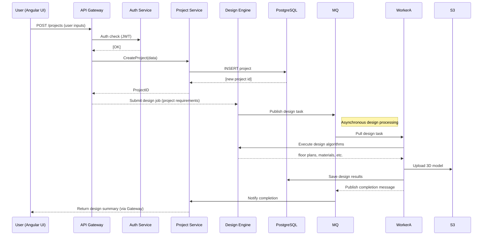

# Architecture Diagrams
The diagrams below show the system structure and data flows. The microservices are organized around domain boundaries (Project management, Design, AR, etc.), as recommended in cloud microservices patterns.  

**Figure 1. System Overview:** shows the high-level services and interactions (reproduced above).  

**Mermaid Sequence:** The startup sequence and data flow for a new project:  

These diagrams ensure *everything* is well-defined. All arrows and steps must be formally implemented in the APIs and services.
