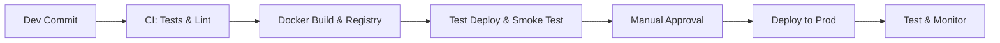

# CI/CD Pipeline Design
We implement an automated pipeline (GitHub Actions or AWS CodePipeline):  
1. **Code Commit:** Developers push to a repo (GitHub). Enforce branch protection and code review.  
2. **Build & Test Stage:** On push to main, run lint, security scans (Dependabot, Snyk), unit tests (PyTest for backend, Karma/Jest for Angular). Fail pipeline on any error.  
3. **Docker Build:** If tests pass, build Docker images for each service, tag by commit SHA, and push to container registry (ECR or GCR).  
4. **Deploy to Dev/Staging:** Automatically deploy images to a dev Kubernetes namespace via Helm/Kustomize. Run smoke tests (API endpoints).  
5. **Manual Approval:** A gate for QA review.  
6. **Deploy to Production:** After approval, deploy to prod cluster. Use blue-green or canary strategy.  
7. **Post-Deploy Tests:** Run integration tests against live endpoints. If failures, rollback.  

Use Infrastructure-as-Code (Terraform or AWS CDK) to provision clusters and services. Secure pipelines by scanning for secret leaks and limiting permissions. All artifacts and pipeline configs are stored in version control.
