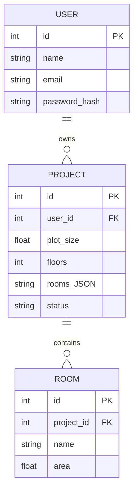

# Data Models (ER Diagrams)
The key data entities for Phase 1 are **User**, **Project**, **Room**. Future phases will add entities like `FloorPlan`, `DesignResult`, `MaterialList`, etc. Example ER diagram:  

- **User**: authentication data.  
- **Project**: stores the requirements and status. `rooms_JSON` (or a related table) holds a list of requested rooms.  
- **Room**: (for MVP) optionally store each room’s area as computed.  
Future tables: `Design` (3D model metadata), `Task` (status of async jobs), etc. All IDs are surrogate keys. Relationships use foreign keys (e.g. PROJECT.user_id→USER.id). Use SQLAlchemy/SQLModel with Pydantic schemas for validation.
